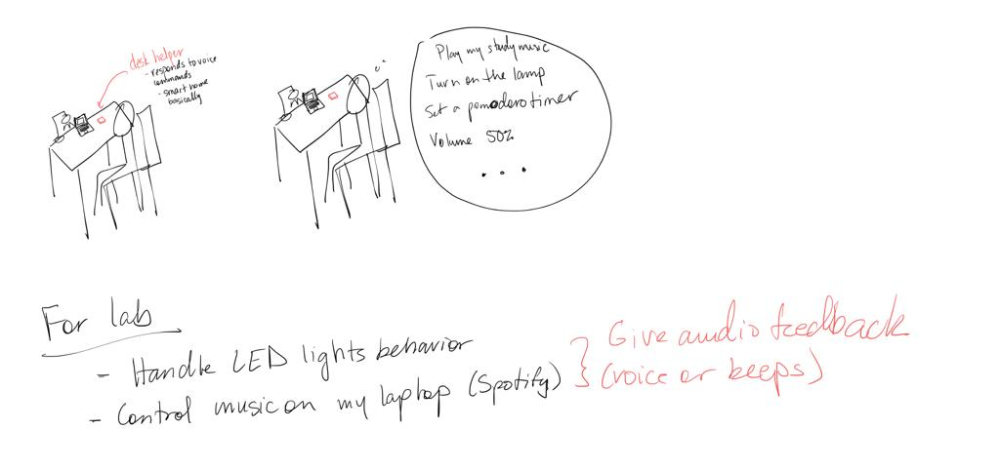
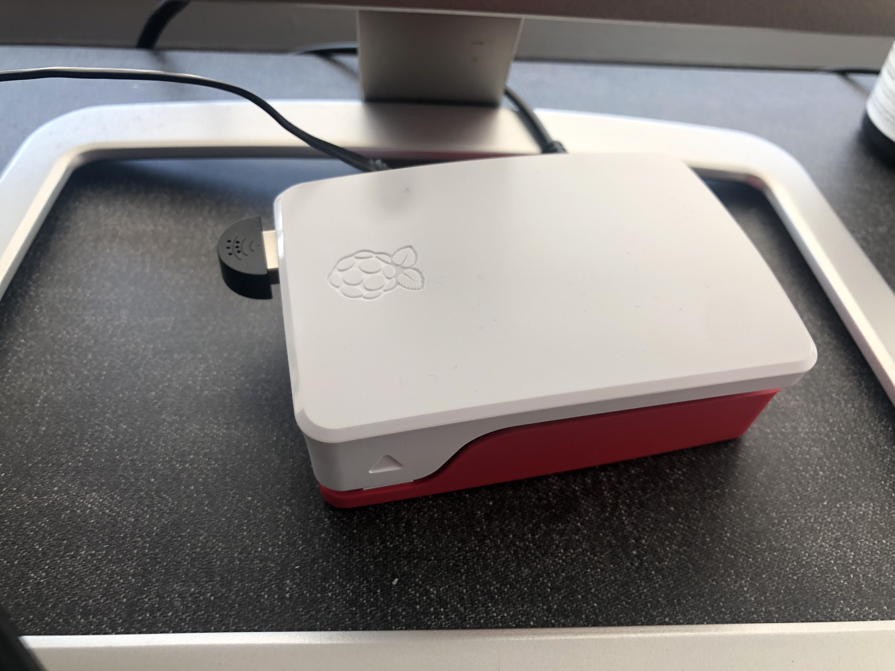
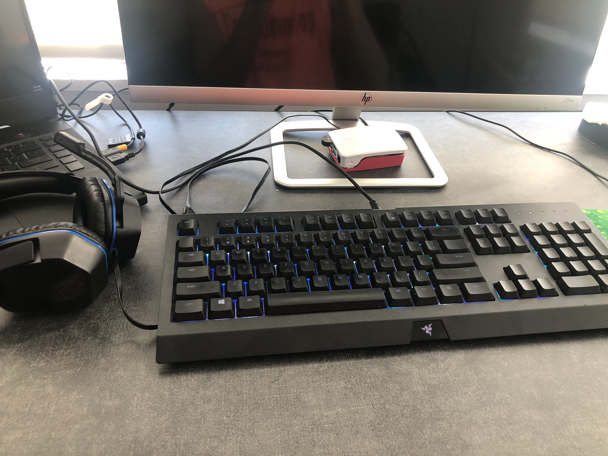
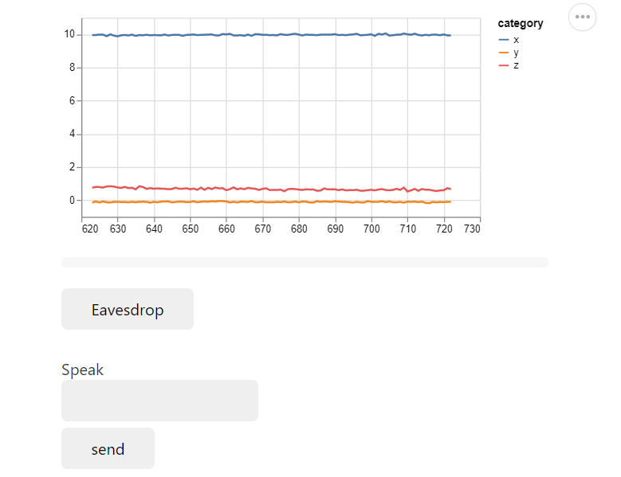

# You're a wizard, Antonio (Griffyndor)


In this lab, we want you to practice wizarding an interactive device as discussed in class. We will focus on audio as the main modality for interaction but there is no reason these general techniques can't extend to video, haptics or other interactive mechanisms. In fact, you are welcome to add those to your project if they enhance your design.


## Text to Speech and Speech to Text

In the home directory of your Pi there is a folder called `text2speech` containing some shell scripts.

```
pi@ixe00:~/text2speech $ ls
Download        festival_demo.sh  GoogleTTS_demo.sh  pico2text_demo.sh
espeak_demo.sh  flite_demo.sh     lookdave.wav

```

you can run these examples by typing 
`./espeakdeom.sh`. Take some time to look at each script and see how it works. You can see a script by typing `cat filename`

```
pi@ixe00:~/text2speech $ cat festival_demo.sh 
#from: https://elinux.org/RPi_Text_to_Speech_(Speech_Synthesis)#Festival_Text_to_Speech

echo "Just what do you think you're doing, Dave?" | festival --tts

```

You can also play audio files directly with `aplay filename`.

After looking through this folder do the same for the `speech2text` folder. In particular, look at `test_words.py` and make sure you understand how the vocab is defined. Then try `./vosk_demo_mic.sh`

## Serving Pages

In Lab 1 we served a webpage with flask. In this lab you may find it useful to serve a webpage for the controller on a remote device. Here is a simple example of a webserver.

```
pi@ixe00:~/$ python server.py
 * Serving Flask app "server" (lazy loading)
 * Environment: production
   WARNING: This is a development server. Do not use it in a production deployment.
   Use a production WSGI server instead.
 * Debug mode: on
 * Running on http://0.0.0.0:5000/ (Press CTRL+C to quit)
 * Restarting with stat
 * Debugger is active!
 * Debugger PIN: 162-573-883
```
From a remote browser on the same network, check to make sure your webserver is working by going to [http://ixe00.local:5000]()


## Demo

In the [demo directory](./demo), you will find an example wizard of oz project you may use as a template. **You do not have to** feel free to get creative. In that project, you can see how audio and sensor data is streamed from the Pi to a wizard controller that runs in the browser. You can control what system says from the controller as well.

## Optional

There is an included [dspeech](./dspeech) demo that uses [Mozilla DeepSpeech](https://github.com/mozilla/DeepSpeech) for speech to text. If you're interested in trying it out we suggest you create a seperarate virutalenv. 


# Lab 3 Part 2

Create a system that runs on the Raspberry Pi that takes in one or more sensors and requires participants to speak to it. Document how the system works and include videos of both the system and the controller.

## Prep for Part 2

1. Sketch ideas for what you'll work on in lab on Wednesday.

## Share your idea sketches with Zoom Room mates and get feedback



Irene pointed out that this would be an interesting thing to build instead of buying an actual smart home "central" device. It also lends itself to have a more customizable aesthetic. She also suggested I think about how I can implement the accelerometer.

Rui suggested that it could have a physical component that the user could interact with that could serve something like a fidget. Maybe the joystick could be a trigger for a mindless/relaxing game on the display.

## Prototype your system

The system should:
* use the Raspberry Pi 
* use one or more sensors
* require participants to speak to it. 

*Document how the system works*
The system is a "work environment helper/assistant" that, when spoken to, can change the lighting in the room or play music on Spotify. The controller, has a USB microphone that is constantly waiting for audio input and will output an audio response. Since it is a prototype, the user will have to wear headphones to listen to the audio output of the system, the music from spotify will be played from the computer that the user is using to work. It will also respond if it senses that it is moved.

*Include videos or screencaptures of both the system and the controller.*

## System




## Controller
The controller will be the webpage activated by [app.py](./demo/app.py) in the [demo](./demo) folder.


## Test the system
Try to get at least two people to interact with your system. (Ideally, you would inform them that there is a wizard _after_ the interaction, but we recognize that can be hard.)
Participant 1: Irene (knew about the wizarding)
Participant 2: Shreya (did now know about the wizarding)

Answer the following:

### What worked well about the system and what didn't?
One of the participants didn't know I was wizarding the system and believed that the system was actually controlling the LED lights in the room and the Spotify on the computer in front of her. Once the participant realized what was happening behind the scenes she made a comment acknowledging why the system response was somewhat slow since I was writing the messages she was hearing in realtime.

### What worked well about the controller and what didn't?
I tested the system in my apartment so I wasn't able to properly use the eavsdrop feature well. It was distracting to be able to hear the person because they were in the room next to me plus hearing them through the raspberry pi but that was good evidence that the microphone was working.

### What lessons can you take away from the WoZ interactions for designing a more autonomous version of the system?
Both participants appreciated that the system would tell them when it was processing a command and weren't just being ignored. Since I was controlling 3 components at once, it took me a few seconds to play a certain song or set the LED lights to display the pattern they would ask, etc. Therefore, I would send messages saying something like "Ok, searching for music by X artists on Spotify" which would give me some time to distract them. Based on this, I think a general convention could be to give the user some sort of feedback before performing the action they requested.

### How could you use your system to create a dataset of interaction? What other sensing modalities would make sense to capture?
I think a camera would have been nice just to see the reactions. The participant that didn't know about the wizarding had no instruction other than just sit down and put on some headphones. Ideally, in a business environment the user would know what they're product would do. I also had participants ask for the lights to be turned on and later ask to change how they were behaving. Also, these experiments were lasted 2-3 minutes. In a longer time setting, a camera could be used to interpret emotion and the system could ask if they weren't enjoying the song, if they were frustrated with the light settings, etc.

The accelerometer was connected to the controller and ready for use. I couldn't think of a use for it for this experiment other than to use as a cue to say something to the user. For example, if they moved the position of the controller I could have responded with "Oh sorry, was I in the way?" and ask 1-2 more probing questions as to what a better setup would have been.

[Google Drive Link of Recording](https://drive.google.com/file/d/1XakzBQde-aJxYEgm6E1XiAlSIm25h9Ri/view?usp=sharing)